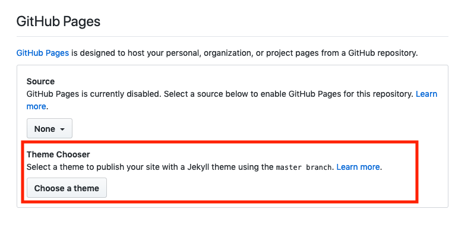
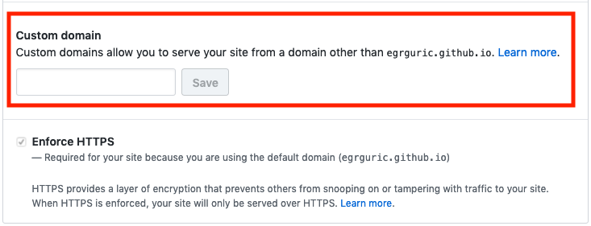

## Setting a different theme

The quickest and easiest way to change your theme for this is to use the default "Theme Chooser" in Github under "Settings > Github Pages" which comes with a small selection of well maintained default themes.

There is also a wide variety of other pre-made Jekyll themes to choose from on GitHub, which can be set up and installed using the same workflow (i.e., **fork** and **publish** on GitHub Pages) described in this workshop. For example, you can find a curated selection of free themes on [jekyllthemes.io](https://jekyllthemes.io/free), and a much larger user-submitted list on [jekyllthemes.org](http://jekyllthemes.org/).

If you want to make more advanced changes on your own, you can do so by adjusting (or replacing) the CSS files included in your jekyll site.

## Configuring A Custom Domain

You can also quickly and easily change the domain of your site to a custom domain that you have purchased elsewhere.

We  will not be going through this but Github has excellent documentation on [managing custom domains for github pages sites](https://help.github.com/en/github/working-with-github-pages/managing-a-custom-domain-for-your-github-pages-site){:target="_blank"}.
